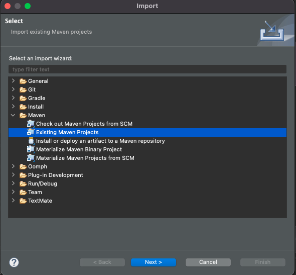
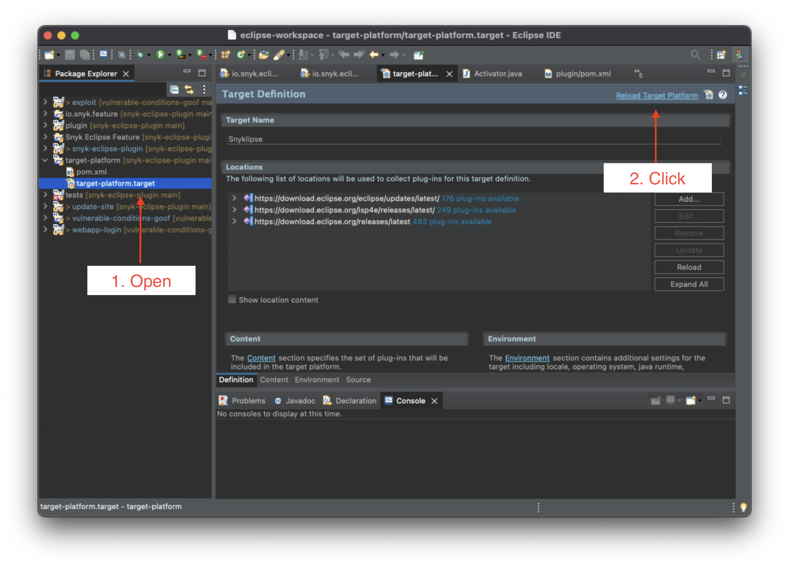
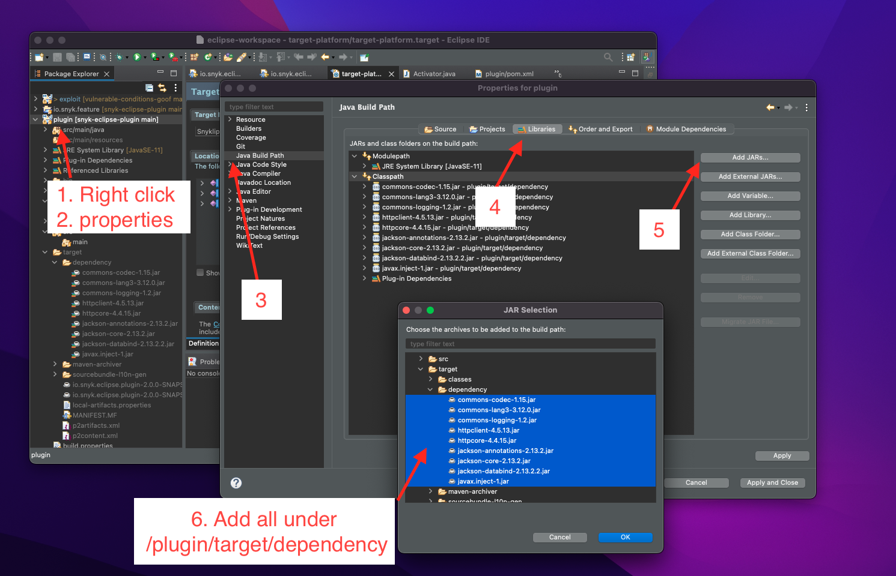
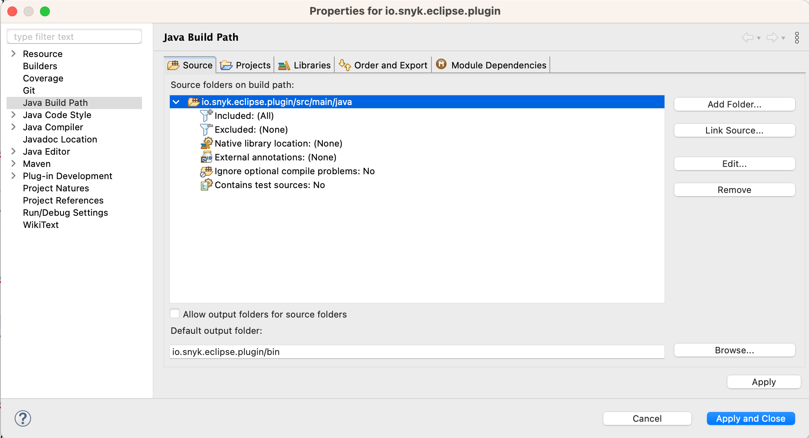

# Contributing

## Configuring the plugin for local development

### Eclipse PDE

In order to get started, you need to install PDE from the eclipse
marketplace.

1. Open Eclipse IDE
2. Go to Help > Install New Software
3. In the install window, select The Eclipse Project Updates
4. In the list, select Eclipse Plugin Development Tools
5. Proceed with the license terms and click Finish.

### Importing the project

If you import the parent project as a maven project, eclipse should take care of everything.

If you encounter some issues with dependencies keep on reading.

#### Sorting out dependencies

If `org.eclipse.*` dependencies are causing compilation errors, open `/target-platform/target-platform.target` and click in the top right corner (Reload Target Platform).

If external dependencies are not picked up:
- run `./mvnw package` to fetch all required jars in the repo root,
- reload Eclipse (F5 in `plugin`)
- and add as external dependencies the jars under `/plugin/target/dependency`

#### Fix compilation errors
Sometimes Java build path is incorrectly set when you import project into Eclipse.

1. Make sure you have source folder set to `src/main/java` for `io.snyk.eclipse.plugin` and `src/test/java` for `io.snyk.eclipse.plugin.tests`.

    Navigate to `Project > Properties > Java Build Path > Source` and make sure the correct folder is selected for both projects.

2. Make sure "Plug-in dependencies" and "Maven managed dependencies" are also on the Classpath.

    Navigate to `Project > Properties > Java Build Path > Libraries`. Select "Classpath" and "Add Library...", then select "Plug-in dependencies" and "Finish". Perform the same steps for "Maven managed dependencies".

### Running the plugin

In order to run Eclipse with the plugin, double-click `plugin.xml`
and click the overview tab. From there you can run a new instance of
eclipse by clicking "Launch an Eclipse application".

