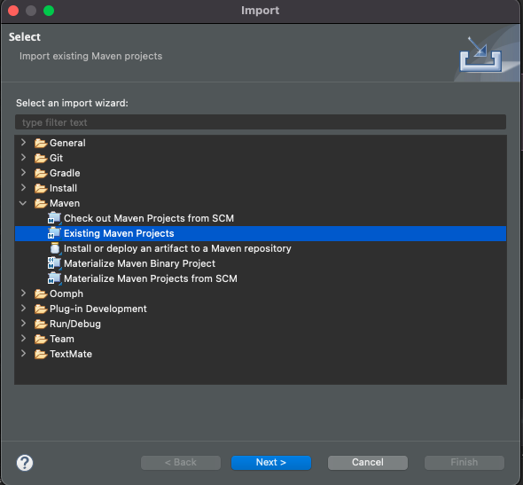
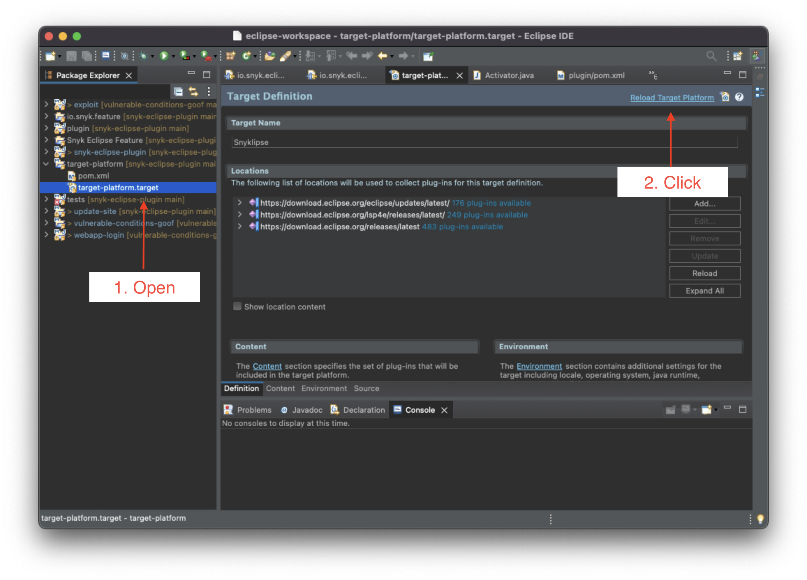
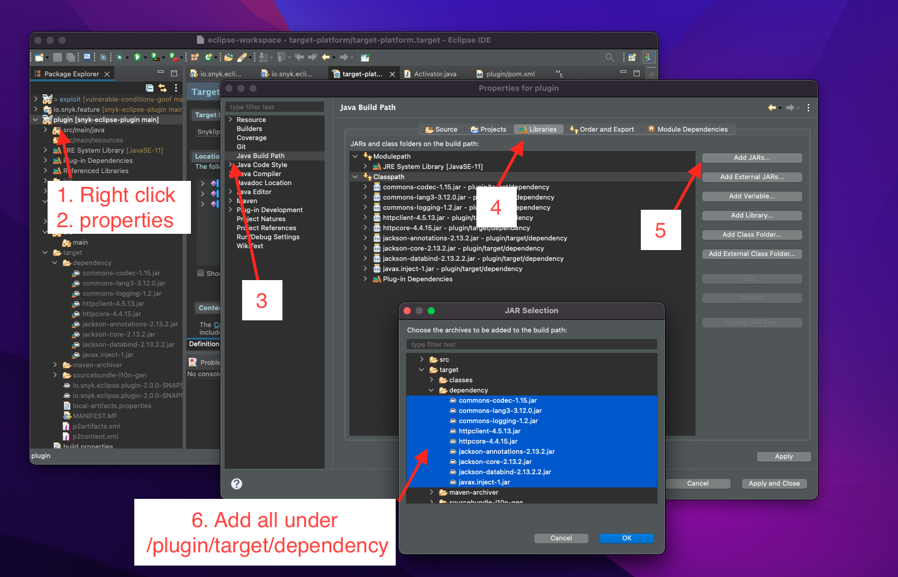
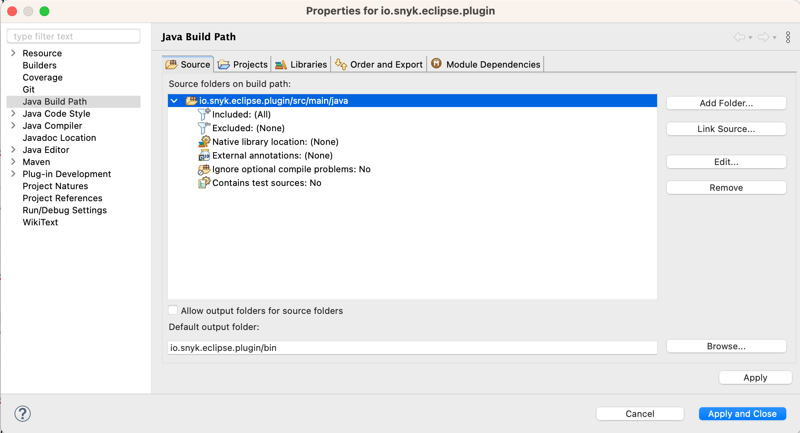

# Contributing to the Snyk IDE Extensions

## Quick start

Requirements:

- **JDK 17** (Temurin recommended — CI pins to 17). [SDKMAN!](https://sdkman.io/) makes version switching easy; this repo ships an `.sdkmanrc`.
- **Eclipse IDE for RCP and RAP Developers**, 2024-12 or newer ([download](https://www.eclipse.org/downloads/packages/)). This package already includes PDE — no separate install needed. On Apple Silicon, pick the `aarch64` build.

Run from a checkout of this repo:

```sh
./scripts/setup.sh
```

The script:

1. Verifies your JDK version and `JAVA_HOME`.
2. Runs `./mvnw -version`.
3. Runs `./mvnw package -DskipTests` to download the Eclipse target platform and all Maven dependencies.
4. Verifies the build produced `update-site/target/update-site-*.zip`.
5. Prints the remaining Eclipse IDE steps (project import, target platform reload, launch config) that cannot be scripted.

If anything in the Eclipse IDE breaks after import, see [Troubleshooting](#troubleshooting) below.

---

## Project policy

We welcome contributions, but please read first! To ensure a smooth process and that your valuable work aligns with our roadmap, please keep the following in mind to help manage expectations:

### 1. Planning your changes

Before undertaking any changes or new features, please discuss your plans with us. This helps align on scope, design, technical approach, and priority.  
Even bug fixes can have unforeseen impacts or alternative solutions better suited for the codebase, so please ask first, we will be happy to discuss.  
Please raise a request with [support](https://support.snyk.io). (Snyk employees, use `#ask-ide`)

### 2. Where changes should be made

Consider whether your proposed change should be implemented within the IDE extension(s) or in the shared Language Server and related stack.
- [Snyk Language Server](https://github.com/snyk/snyk-ls)
- [Go Application Framework](https://github.com/snyk/go-application-framework)
- [Code Client Go](https://github.com/snyk/code-client-go)

### 3. Cross-IDE consistency

If your change is applicable to other Snyk IDE plugins as well, we may expect you to submit similar PRs for the other relevant IDE repositories after your initial PR has been reviewed and approved, as they will _usually_ need to be merged all at once or not at all.
- [Snyk VSCode extension](https://github.com/snyk/vscode-extension)
- [Snyk IntelliJ plugin](https://github.com/snyk/snyk-intellij-plugin)
- [Snyk Visual Studio extension](https://github.com/snyk/snyk-visual-studio-plugin)

### 4. Manual testing

All changes must be thoroughly manually tested by you.  
For visual changes the PR template asks for screenshots, so this is a good opportunity to snap them.

### 5. Documentation changes

Any user-facing changes will require [documentation](https://docs.snyk.io/) changes, which you will need to prepare.
If you do not have access to our content management system (you are not a Snyk employee), please add the documentation changes required (including new wording and screenshots) to the PR description.

We can instruct you on what to add to the CHANGELOG.md, so please ask.

---

## Importing into Eclipse

After running `./scripts/setup.sh`, complete these steps in the IDE:

1. **File > Import > Maven > Existing Maven Projects** — select this repo root, then accept all submodules.

   

2. Open `target-platform/target-platform.target` and click **Reload Target Platform** in the top-right corner. Wait for the resolve to finish (status bar at the bottom).

   

3. To launch a sandbox Eclipse with the plugin loaded: open `plugin/plugin.xml`, go to the **Overview** tab, click **Launch an Eclipse application**.

## Troubleshooting

### `org.eclipse.*` cannot be resolved

The target platform did not load. Re-do step 2 of [Importing into Eclipse](#importing-into-eclipse).

### External (non-`org.eclipse.*`) dependencies missing

- Run `./mvnw package` from the repo root to populate `plugin/target/dependency/`.
- Refresh the `plugin` project in Eclipse (F5).
- If the JARs still aren't picked up, add them manually as external dependencies under `Project > Properties > Java Build Path > Libraries`.

  

### Java build path is wrong after import

1. Set source folder to `src/main/java` for `io.snyk.eclipse.plugin` and `src/test/java` for `io.snyk.eclipse.plugin.tests`. Navigate to `Project > Properties > Java Build Path > Source`.

   

2. Ensure "Plug-in dependencies" and "Maven managed dependencies" are on the Classpath. `Project > Properties > Java Build Path > Libraries > Add Library...` — add both.
