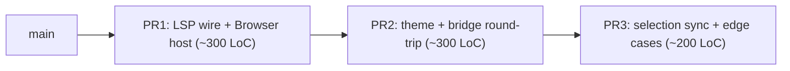

# IDE-1837 — Show Snyk results in HTML tree view sent from Language Server

> **Status:** Phase 1 (Planning) — DRAFT, awaiting confirmation
> **Branch:** `feat/IDE-1837_show-results-in-tree-view`
> **Goal (one line):** Render the LS-emitted HTML tree (`$/snyk.treeView`) inside an embedded SWT `Browser` in the Snyk tool view, with bidirectional bridge so clicks/expansion/filters round-trip to the LS.

---

## SESSION RESUME

### Quick Context
- **Ticket:** IDE-1837 — Show Snyk results in tree view (Eclipse client side of an LS feature already shipped in `snyk-ls`).
- **Branch:** `feat/IDE-1837_show-results-in-tree-view` (no commits ahead of `main` yet).
- **Reference impl:** `~/workspace/snyk-intellij-plugin` (`HtmlTreePanel.kt`, `ExecuteCommandBridge.kt`, `ThemeBasedStylingGenerator.kt`, `SnykLanguageClient.snykTreeView`).
- **LS source of truth:** `~/workspace/snyk-ls-2/domain/ide/treeview/` (templates) + `application/server/notification.go:141-143` (notifier) + `internal/types/lsp.go` (`TreeView{TreeViewHtml,TotalIssues}`).

### Current State
| Item | Status |
|---|---|
| Plan written | ✅ this file |
| `tests.json` initialized | ✅ |
| Mermaid diagrams | ✅ in `docs/diagrams/IDE-1837_*.mmd` |
| LSP notification handler in client | ❌ to add |
| `TreeViewBrowserHandler` SWT class | ❌ to create |
| `__selectTreeNode__` sync bridge | ❌ to add (PR2/3) |
| Theme/CSS variable injection | ❌ to add (PR2) |
| `plugin.xml` view registration changes | TBD — depends on placement decision |

### Next Actions (after plan approval)
1. Begin Phase 2 — Step 2.1 (smoke test T-S-001 → LSP wire-up). Add `Preferences.USE_HTML_TREE_VIEW` (default `false`) and the new `Browser` instance toggled by it.

### Current Working Files
| Path | Why it matters |
|---|---|
| [plugin/src/main/java/io/snyk/languageserver/protocolextension/SnykExtendedLanguageClient.java](plugin/src/main/java/io/snyk/languageserver/protocolextension/SnykExtendedLanguageClient.java) | Where new `@JsonNotification("$/snyk.treeView")` handler lives. |
| [plugin/src/main/java/io/snyk/languageserver/LsConstants.java](plugin/src/main/java/io/snyk/languageserver/LsConstants.java) | Add `SNYK_TREE_VIEW = "$/snyk.treeView"` constant. |
| [plugin/src/main/java/io/snyk/languageserver/protocolextension/messageObjects/](plugin/src/main/java/io/snyk/languageserver/protocolextension/messageObjects/) | Add `TreeViewParams { treeViewHtml, totalIssues }` (mirror `SummaryPanelParams`). |
| [plugin/src/main/java/io/snyk/eclipse/plugin/views/snyktoolview/SnykToolView.java:74-150](plugin/src/main/java/io/snyk/eclipse/plugin/views/snyktoolview/SnykToolView.java#L74-L150) | `createPartControl` — add new `Browser` instance & `TreeViewBrowserHandler`. |
| [plugin/src/main/java/io/snyk/eclipse/plugin/views/snyktoolview/SummaryBrowserHandler.java](plugin/src/main/java/io/snyk/eclipse/plugin/views/snyktoolview/SummaryBrowserHandler.java) | Direct template for the new `TreeViewBrowserHandler` (same shape). |
| [plugin/src/main/java/io/snyk/eclipse/plugin/html/ExecuteCommandBridge.java](plugin/src/main/java/io/snyk/eclipse/plugin/html/ExecuteCommandBridge.java) | **Already implements `window.__ideExecuteCommand__`** — reuse as-is for the tree's command bridge. |
| [plugin/plugin.xml:11-29](plugin/plugin.xml#L11-L29) | View registration & perspective extension. |

---

## Phase 1 — Planning

### 1.1 Requirements Analysis

**Functional**
1. Subscribe to LSP notification `$/snyk.treeView` (params: `{ treeViewHtml: string, totalIssues: int }`).
2. Render `treeViewHtml` inside an SWT `Browser` (Edge on Windows, WebKit elsewhere) hosted in the Snyk tool view.
3. Wire the `window.__ideExecuteCommand__(cmd, args, cb)` JS bridge so the tree's clicks reach the LS via `workspace/executeCommand`. Commands the JS will issue (per `domain/ide/treeview/template/tree.js`):
   - `snyk.setNodeExpanded` — persist single/batch expansion state
   - `snyk.navigateToRange` — open file at range (also drives editor focus)
   - `snyk.toggleTreeFilter` — severity / open vs ignored toggle
   - `snyk.updateFolderConfig` — delta base branch / reference folder
   - `snyk.showScanErrorDetails` — log / show inline error overlay
4. Inject CSS variable shim (`--vscode-*`) so the LS template renders against Eclipse theme colors (light/dark/HC).
5. Expose `window.__selectTreeNode__(issueId)` so the IDE can sync the tree's highlighted node when selection changes elsewhere (e.g. from editor markers).
6. **Do not** issue an initial `getTreeView` request — match IntelliJ's "listen for push" pattern. The first scan triggers the first notification.

**Non-functional**
- No new lsp4j/lsp4e version bumps. Reuse `ExecuteCommandBridge` (already merged for the settings page).
- Stay within OSGi bundle visibility — new classes go under existing `io.snyk.eclipse.plugin.views.snyktoolview` and `io.snyk.languageserver.protocolextension.messageObjects`.
- All UI updates marshalled to the SWT thread via `Display.getDefault().asyncExec(...)`.
- Browser content set via `browser.setText(html)` (NOT a `file://` URL). The LS HTML is self-contained (CSS + JS embedded with nonces).

**Files to modify**
- `plugin/src/main/java/io/snyk/languageserver/LsConstants.java` — add constant.
- `plugin/src/main/java/io/snyk/languageserver/protocolextension/SnykExtendedLanguageClient.java` — add `@JsonNotification` handler + dispatch to `SnykToolView`.
- `plugin/src/main/java/io/snyk/eclipse/plugin/views/snyktoolview/SnykToolView.java` — host the new `Browser`; expose `updateTreeViewHtml(String)` + `selectTreeNode(String issueId)` on `ISnykToolView`.
- `plugin/src/main/java/io/snyk/eclipse/plugin/views/snyktoolview/ISnykToolView.java` — add the two methods.
- `plugin/plugin.xml` — only if we add a *separate* view (decision pending).

**Files to create**
- `plugin/src/main/java/io/snyk/languageserver/protocolextension/messageObjects/TreeViewParams.java`
- `plugin/src/main/java/io/snyk/eclipse/plugin/views/snyktoolview/TreeViewBrowserHandler.java`
- `plugin/src/main/java/io/snyk/eclipse/plugin/html/EclipseThemeCssProvider.java` — generates `<style>` block resolving `--vscode-*` vars to Eclipse colors.
- Tests in `tests/src/test/java/...` mirroring existing test structure.

**Out of scope (this ticket)**
- Removing the legacy `TreeViewer` — done in a follow-up if/when the HTML tree is the default and stable.
- LS-side changes — already shipped.
- Per-issue detail browser (`browser` field in `SnykToolView`) — keep as-is; the new HTML tree replaces only the **left-hand tree column**, not the right-hand detail panel.

### 1.2 Schema / Data shape

Java DTO (mirror `SummaryPanelParams`):
```java
public class TreeViewParams {
  private String treeViewHtml;
  private int totalIssues;
  // getters/setters
}
```

LSP wire (Go side):
```go
type TreeView struct {
  TreeViewHtml string `json:"treeViewHtml"`
  TotalIssues  int    `json:"totalIssues"`
}
```

JS bridge contract (already provided by `ExecuteCommandBridge`):
- JS → Java: `window.__ideExecuteCommand__(command: string, args: any[], callback?: fn)`
- Java → JS (sync only): `window.__selectTreeNode__(issueId: string)` via `browser.evaluate(...)`

### 1.3 Flow Diagrams

Sources committed under `docs/diagrams/`:
- `IDE-1837_lsp_to_tree_flow.mmd` — LS notification → handler → browser update
- `IDE-1837_bridge_call_flow.mmd` — JS click → bridge → CommandHandler → LS executeCommand → callback
- `IDE-1837_pr_stack.mmd` — PR stacking diagram (used in PR descriptions)

---

## Phase 2 — Implementation (Outside-in TDD)

> **Test order discipline:** Smoke (E2E) first → Integration (cross-class behaviour) → Unit. Plan self-check passed: integration tests appear in step 2.2 *before* unit tests (step 2.3).

### Step 2.1 — Wire LSP notification → Browser (PR1, ~250-350 LoC)

**Outside-in tests first** (in `tests/src/test/java/io/snyk/languageserver/protocolextension/`):
- **Smoke** `TreeViewSmokeTest` (T-S-001): Drive the real `SnykExtendedLanguageClient` with a synthetic `$/snyk.treeView` notification; assert the SWT `Browser` text equals the payload's `treeViewHtml` (within an SWT-aware test runner — reuse the pattern from existing browser tests).
- **Integration** `SnykExtendedLanguageClient_TreeViewTest` (T-I-001): Mock `ISnykToolView`; verify the handler unpacks `TreeViewParams`, then calls `toolView.updateTreeViewHtml(html)` on the SWT thread.

**Implementation:**
1. Add `LsConstants.SNYK_TREE_VIEW = "$/snyk.treeView"`.
2. Create `TreeViewParams` DTO.
3. Add `@JsonNotification(value = LsConstants.SNYK_TREE_VIEW) public void snykTreeView(TreeViewParams p)` in `SnykExtendedLanguageClient` — single line of logic: `getToolView().updateTreeViewHtml(p.getTreeViewHtml())`.
4. Add `void updateTreeViewHtml(String html)` to `ISnykToolView`.
5. Create `TreeViewBrowserHandler` (constructor takes `Browser`; `initialize()` sets a placeholder; `setHtml(String)` calls `browser.setText` on UI thread; `ExecuteCommandBridge.install(browser)` registers the bridge).
6. In `SnykToolView.createPartControl`, add a new `Browser treeBrowser = new Browser(verticalSashForm, SWT.EDGE)` next to the existing `TreeViewer`; `treeBrowserHandler = new TreeViewBrowserHandler(treeBrowser); treeBrowserHandler.initialize();`. Visibility is gated by `Preferences.USE_HTML_TREE_VIEW` (set `treeBrowser.setVisible(false)` + `((GridData) treeBrowser.getLayoutData()).exclude = true` when false; mirror with `treeViewer.getControl()` for the legacy tree). Add a preference-change listener to flip them at runtime.
7. `SnykToolView.updateTreeViewHtml(html)` → `treeBrowserHandler.setHtml(html)`.

**Commit:** `feat(IDE-1837): wire $/snyk.treeView LSP notification to embedded browser`

### Step 2.2 — Bridge round-trip + theme (PR2, ~250-350 LoC, stacks on PR1)

**Tests first:**
- **Integration** `TreeViewBridgeTest` (T-I-002): Load a fixture HTML that calls `window.__ideExecuteCommand__('snyk.navigateToRange', [path, range])`; assert `CommandHandler.executeCommand` is invoked with the right args.
- **Integration** `TreeViewBridgeTest` (T-I-003): For `snyk.setNodeExpanded`, batch arg `[[id1,true],[id2,false]]`; assert the JSON dispatched matches.
- **Unit** `EclipseThemeCssProviderTest` (T-U-001): Given a SWT `Display` color provider, return CSS with `--vscode-foreground:#…`. Cover light/dark/HC variants by mocking the color provider.
- **Unit** `TreeViewBrowserHandlerTest` (T-U-002): `setHtml(null)` is a no-op; `setHtml("<html>")` injects theme CSS prefix.

**Implementation:**
1. Implement `EclipseThemeCssProvider` — port the `--vscode-*` variable list from `domain/ide/treeview/template/styles.css` to a tiny generator that reads Eclipse `Display` system colors (`SWT.COLOR_LIST_BACKGROUND`, `COLOR_LIST_FOREGROUND`, `COLOR_LIST_SELECTION`, etc.) and emits `<style>:root{ --vscode-foreground: #rrggbb; … }</style>`.
2. `TreeViewBrowserHandler.setHtml`: prefix with the generated `<style>` block (or substitute into a `${ideStyle}` placeholder if the LS template exposes one — verify against `tree.html`).
3. Confirm `ExecuteCommandBridge` is auto-installed (it already is via `install(browser)` in step 2.1).

**Commit:** `feat(IDE-1837): apply Eclipse theme to LS tree HTML and verify bridge round-trip`

### Step 2.3 — Selection sync + edge cases (PR3, ~150-250 LoC, stacks on PR2)

**Tests first:**
- **Integration** `TreeViewSelectionSyncTest` (T-I-004): When the editor selection changes to a Snyk-marked range, assert `browser.evaluate("window.__selectTreeNode__('issueId')")` is called.
- **Unit** `TreeViewBrowserHandlerTest` (T-U-003): `selectNode(id)` escapes `id` for JS string literal.
- **Unit** `TreeViewBrowserHandlerTest` (T-U-004): `setHtml` while `browser.isDisposed()` is a no-op.
- **Regression** `TreeViewSmokeTest` (T-R-001): The existing `$/snyk.scan` flow (legacy tree population) must still work — the HTML tree only adds, never removes, behaviour in this PR.

**Implementation:**
1. Add `selectTreeNode(String issueId)` to `ISnykToolView` + `TreeViewBrowserHandler`.
2. Hook editor-selection listener (existing pattern in `SnykToolView`) to call `selectTreeNode` when an `IssueTreeNode` is the active selection. (Wire is bidirectional once the legacy tree is also driven by the same source.)
3. Handle `null`/empty HTML payloads, browser disposal during async update, and deferred init (browser may not be ready when first notification arrives — buffer the latest HTML).

**Commit:** `feat(IDE-1837): bidirectional tree node selection sync via __selectTreeNode__`

### Plan self-check
- ✅ Smoke before integration before unit.
- ✅ Each step ≤ ~350 LoC (under 700 hard limit).
- ✅ Each step has a clear single-commit shape.
- ✅ Each step is independently testable with `./mvnw verify`.

---

## Phase 3 — Review

### Pre-commit (per step)
- [ ] `./mvnw verify` passes locally.
- [ ] `qa` subagent run on the diff — all Critical/Should-Fix findings addressed.
- [ ] `pr-review-bot` subagent run — zero blocking findings.
- [ ] `snyk code test` + `snyk test` (per `.cursorrules`) clean.
- [ ] No new lint warnings.

### Documentation
- [ ] Update `docs/` with the bridge contract and a short "How the HTML tree is rendered" page.
- [ ] PNG renders for the mermaid diagrams (kroti or local mmdc).
- [ ] CHANGELOG entry under "Unreleased".

### PR description (every PR in the stack)
Must include:
1. The stack diagram from `docs/diagrams/IDE-1837_pr_stack.mmd`.
2. "Depends on #N" + "Part of IDE-1837 stack".
3. Checklist of what this PR includes vs. what is deferred to the next.

---

## Resolved Decisions (2026-05-08)

1. **Placement**: behind a new preference `Preferences.USE_HTML_TREE_VIEW`, default OFF. The HTML tree `Browser` is added to the existing `verticalSashForm` in `SnykToolView.createPartControl` *next to* the legacy `TreeViewer`; visibility/exclusion of each is driven by the preference. Allows safe rollout + easy dogfooding flip.
2. **Detail panel**: keep the right-hand `BrowserHandler` (issue details) untouched — out of scope.
3. **Initial fetch**: listen-only, match IntelliJ. No `snyk.getTreeView` request on connect. Smoke test T-S-001 verifies the first scan produces a non-empty render.

These decisions are reflected in steps 2.1–2.3 below; no further blockers.

---

## Progress Tracking

| Step | Status | PR | Date |
|---|---|---|---|
| 1.1 Requirements | ✅ | — | 2026-05-08 |
| 1.2 Schema | ✅ | — | 2026-05-08 |
| 1.3 Diagrams | ✅ | — | 2026-05-08 |
| 2.1 LSP wire-up | ✅ completed | feat/IDE-1837_show-results-in-tree-view | 2026-05-08 |
| 2.2 Bridge + theme | ✅ completed | feat/IDE-1837_show-results-in-tree-view | 2026-05-08 |
| 2.3 Selection sync | — | — | — |
| Phase 3 Review | — | — | — |

### Session Log
- **2026-05-08, Session #1** — Plan + tests.json + diagrams created. Awaiting user decision on Open Questions (#1 in particular).
- **2026-05-08, Session #2** — Step 2.1 implemented and committed (7fd3e21). TDD: tests written first (T-S-001 DTO test, T-I-001 dispatch test), then production code. All staged files: TreeViewParams.java, TreeViewBrowserHandler.java, LsConstants.java, ISnykToolView.java, SnykToolView.java, SnykExtendedLanguageClient.java, Preferences.java, TreeViewNotificationTest.java. Pre-existing Mockito/Java 21 infrastructure failures noted (119 errors, pre-exist before this change, same count after). Compile clean.
- **2026-05-08, Session #3** — Step 2.2 implemented and committed (25f7ab6). TDD: failing tests written first (EclipseThemeCssProviderTest, TreeViewBrowserHandlerTest, TreeViewBridgeTest), then EclipseThemeCssProvider.java created and TreeViewBrowserHandler.setBrowserText updated with injectThemeCss. Fixed SWT.COLOR_WIDGET_SHADOW (does not exist) → COLOR_WIDGET_DARK_SHADOW. All 18 new tests pass. BUILD SUCCESS.

---

## PR Size Gate & Stacking

Hard limit: **700 changed lines per PR**. Estimated split:



If a step exceeds 700 LoC, split via `git worktree add ../snyk-eclipse-plugin-IDE-1837-prN -b feat/IDE-1837-prN` and stack the new PR on the previous branch.

---

## Subagent Workflow

Per project rules: **planner → coder → qa → (coder fixes) → commit (with pr-review-bot)**.

- `coder` writes tests first per the TDD discipline above.
- `qa` runs after each step's implementation — deep verification before commit.
- `pr-review-bot` runs as the final gate before push.
