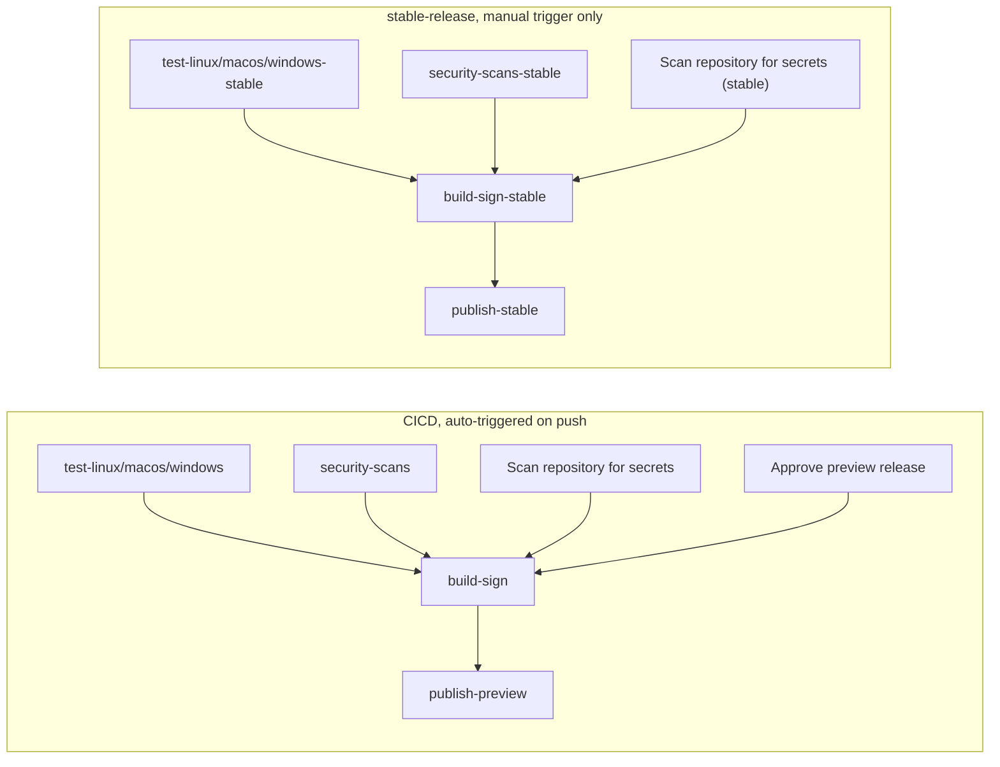

# Release process

## Cutting a stable release

Stable releases are cut on demand from CircleCI's `stable-release` workflow. It
never runs automatically; see `RELEASE.md` for how to release. The pipeline
re-runs the full test matrix, builds and signs the plugin, assumes the
`snyk-assets-eclipse-writer` IAM role via OIDC, tags the release commit, creates
the GitHub release with the update-site ZIP asset, and uploads the p2 repository
to `s3://snyk-assets/eclipse/stable/`.

### Safeguards

A normal push to `main` does not cut a stable release. Approving
`Approve preview release` on the auto-triggered `CICD` pipeline does not cut
one either: it only publishes the preview channel. A stable release needs a
separate, deliberate manual trigger of the `stable-release` pipeline, gated by
the `run_stable_release` pipeline parameter (default `false`).

Trigger only via CircleCI's web UI, never the API: the manual click is a
deliberate human checkpoint before a stable release ships, not a technical
restriction (the API and UI hit the same endpoint).

## Preview releases

On pushes/merges to `main`, an approval gate (`Approve preview release`) appears
in CircleCI after build, testing, and signing complete. Clicking approve
publishes to `s3://snyk-assets/eclipse/preview/`.

## Independence of the two workflows

The two workflows share no jobs, no `requires:` chain, and no workspace. A
`stable-release` pipeline is always a separate pipeline run from any `CICD` run
on the same commit.
